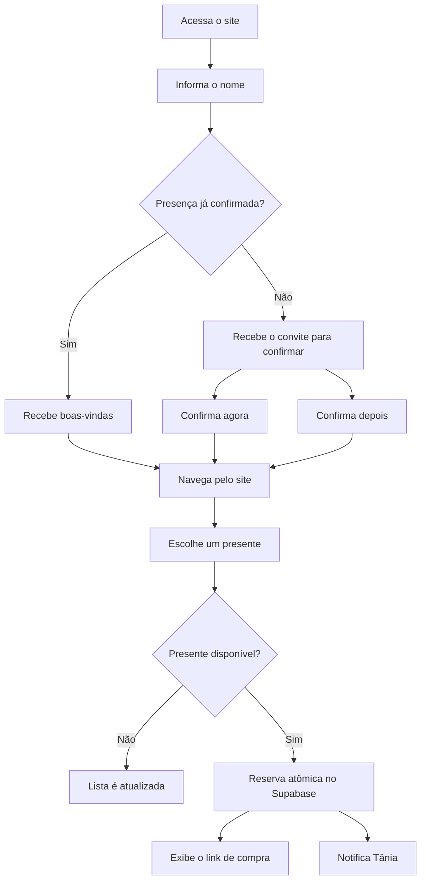

<div align="center">

# 💍 Noivado e Chá de Bênção — Tânia Maria & Eliclécio Batista

### Convite digital responsivo com confirmação de presença, lista de presentes e integração em tempo real

[](https://developer.mozilla.org/pt-BR/docs/Web/HTML)
[](https://developer.mozilla.org/pt-BR/docs/Web/CSS)
[](https://developer.mozilla.org/pt-BR/docs/Web/JavaScript)
[](https://supabase.com/)
[](https://vercel.com/)


</div>

---

## 📖 Sobre o projeto

Este projeto é um **site responsivo para o Noivado e Chá de Bênção de Tânia Maria e Eliclécio Batista**. A aplicação transforma o convite tradicional em uma experiência digital interativa, permitindo que os convidados consultem os detalhes da celebração, confirmem presença, acompanhem a contagem regressiva e reservem presentes.

A persistência global é fornecida pelo **Supabase**, com funções PostgreSQL que evitam reservas duplicadas. A solução também possui uma **Supabase Edge Function** opcional para notificar Tânia pela WhatsApp Cloud API quando um convidado escolher um presente.

## ✨ Funcionalidades

- Pop-up de identificação do convidado por nome.
- Reconhecimento de convidados que já confirmaram presença.
- Mensagem personalizada para confirmação do Noivado e Chá de Bênção.
- Confirmação de presença imediata ou em outro momento.
- Data, horário, local, versículo e contagem regressiva.
- Mini player fixo do YouTube, acompanhando o rolamento da página.
- Reprodução automática sem som e tentativa de ativação do áudio após a primeira interação.
- Lista de presentes com imagem, descrição, valor e link de compra.
- Confirmação antes da reserva do presente.
- Bloqueio global e atômico para impedir que duas pessoas reservem o mesmo item.
- Atualização periódica da disponibilidade dos presentes.
- Notificação automática pelo WhatsApp quando a Cloud API estiver configurada.
- Fallback manual com mensagem pronta quando a integração automática não estiver disponível.
- Layout adaptado para celulares, tablets e computadores.

## 🔄 Jornada do convidado



## 🧰 Tecnologias

| Camada | Tecnologia | Responsabilidade |
|---|---|---|
| Interface | HTML5 | Estrutura semântica, conteúdo e modais |
| Estilização | CSS3 | Identidade floral, responsividade e animações |
| Aplicação | JavaScript ES Modules | RSVP, presentes, player e integrações |
| Banco de dados | PostgreSQL / Supabase | Convidados, confirmações e reservas |
| Backend serverless | Supabase Edge Functions | Notificação segura pelo WhatsApp |
| Música | YouTube IFrame Player API | Reprodução da playlist da celebração |
| Mensageria | WhatsApp Cloud API | Notificação da escolha do presente |
| Hospedagem | Vercel | Deploy do frontend estático |

## 🏗️ Arquitetura

```text
Navegador do convidado
        │
        ├── HTML + CSS + JavaScript
        │        ├── YouTube IFrame Player API
        │        └── Supabase JavaScript Client
        │
        ▼
Supabase
        ├── PostgreSQL
        │     ├── guests
        │     ├── gifts
        │     └── funções RPC
        │
        └── Edge Function: notify-bride
                    │
                    ▼
            WhatsApp Cloud API
```

A reserva é concluída por uma função no PostgreSQL que atualiza o item somente quando ele ainda não possui um responsável. Isso garante consistência mesmo quando duas pessoas tentam reservar o mesmo presente quase simultaneamente.

## 📁 Estrutura

```text
site-noivado-cha-de-bencao-tania-elicelio/
├── assets/
│   ├── convites/
│   │   └── convite-noivado-cha-de-bencao.svg
│   ├── gifts/
│   └── music/
├── supabase/
│   ├── functions/
│   │   └── notify-bride/
│   │       └── index.ts
│   ├── admin-queries.sql
│   └── schema.sql
├── api.js
├── app.js
├── config.js
├── index.html
├── styles.css
├── vercel.json
├── .gitignore
└── README.md
```

## 🚀 Executando localmente

O projeto é estático e não exige instalação de dependências.

### Live Server

1. Abra a pasta no VS Code.
2. Instale a extensão **Live Server**.
3. Clique com o botão direito em `index.html`.
4. Selecione **Open with Live Server**.

### Python

```bash
python -m http.server 5500
```

Acesse `http://localhost:5500`.

> Não abra o HTML diretamente pelo explorador, pois os módulos ES podem ser bloqueados pelo navegador.

## ⚙️ Configuração do evento

Edite `config.js`:

```js
export const EVENT_CONFIG = {
  bride: {
    firstName: "Tânia",
    fullName: "Tânia Maria",
  },
  groom: {
    firstName: "Eliclécio",
    fullName: "Eliclécio Batista",
  },
  monogram: "T & E",
  event: {
    name: "Noivado e Chá de Bênção",
    invitationText: "Convidamos você para celebrar o nosso Noivado e Chá de Bênção",
  },
  dateISO: "2026-09-15T20:00:00-03:00",
  dateLabel: "15 de setembro de 2026",
  timeLabel: "20:00 horas",
  venue: {
    name: "Nome do espaço da cerimônia",
    address: "Endereço completo da celebração",
    mapsUrl: "https://maps.google.com/",
  },
};
```

## 🗄️ Supabase

Sem Supabase, o site funciona em modo de demonstração e salva os dados somente no navegador. Para habilitar a persistência global:

1. Crie um projeto no Supabase.
2. Abra **SQL Editor**.
3. Execute `supabase/schema.sql`.
4. Copie a **Project URL** e a chave pública `publishable`.
5. Preencha:

```js
supabase: {
  url: "https://SEU-PROJETO.supabase.co",
  publishableKey: "SUA_CHAVE_PUBLICA",
},
```

A chave pública pode ficar no frontend. Nunca publique `service_role`, `sb_secret_...`, senha do banco ou token da Meta.

### Compatibilidade

As funções RPC do SQL mantêm alguns nomes internos originalmente usados durante o desenvolvimento, como `enter_wedding`. Eles foram preservados para não quebrar bancos Supabase já configurados. Todo o conteúdo visível do site representa corretamente o **Noivado e Chá de Bênção**.

## 🎁 Presentes

Os itens iniciais ficam em `supabase/schema.sql`. Cada registro possui:

| Campo | Descrição |
|---|---|
| `name` | Nome do presente |
| `description` | Texto exibido no card |
| `price_cents` | Valor em centavos |
| `image_url` | Caminho ou URL da imagem |
| `purchase_url` | Link da loja |
| `active` | Controla a exibição |

Exemplo: `49990` representa `R$ 499,90`.

## 🔒 Proteção contra reserva duplicada

```sql
update public.gifts
set chosen_by = p_guest_id,
    chosen_at = now()
where id = p_gift_id
  and chosen_by is null;
```

Somente a primeira tentativa consegue alterar o item. As demais recebem a informação de que o presente já foi escolhido.

## 📲 WhatsApp

A integração automática utiliza a Edge Function `notify-bride`. O token da Meta fica no servidor e nunca é enviado ao navegador.

### Modelo de mensagem

Crie no WhatsApp Manager:

```text
presente_noivado_escolhido
```

Corpo:

```text
{{1}} escolheu te dar o presente {{2}}.
```

Exemplo:

```text
Carlos escolheu te dar o presente Jogo de Cama.
```

### Segredos

```bash
supabase secrets set WHATSAPP_TOKEN="SEU_TOKEN"
supabase secrets set WHATSAPP_PHONE_NUMBER_ID="SEU_PHONE_NUMBER_ID"
supabase secrets set BRIDE_WHATSAPP_NUMBER="5582999999999"
supabase secrets set WHATSAPP_TEMPLATE_NAME="presente_noivado_escolhido"
supabase secrets set WHATSAPP_TEMPLATE_LANGUAGE="pt_BR"
supabase secrets set WHATSAPP_GRAPH_API_VERSION="VERSAO_ATIVA"
```

Deploy:

```bash
supabase functions deploy notify-bride
```

Sem a Cloud API, preencha `brideWhatsappNumber` no `config.js`. O site exibirá o botão **Avisar no WhatsApp**, abrindo a mensagem pronta para envio manual.

## 🎵 Playlist

```js
music: {
  provider: "youtube",
  playlistId: "PLCggmkGw79n8V3eZuRpuzETFljnj5-qNw",
  title: "Playlist do Noivado e Chá de Bênção",
},
```

O player fica fixo no canto inferior direito e acompanha o rolamento. No celular, ele usa 168 × 95 px para permanecer como mini player, sem ocupar toda a largura da tela. Por regras dos navegadores, ele inicia sem som e tenta ativar o áudio após a primeira interação do convidado.

## 🧪 Reset dos testes

No SQL Editor:

```sql
begin;

update public.gifts
set
  chosen_by = null,
  chosen_at = null,
  notification_sent_at = null;

delete from public.guests;

commit;
```

No navegador:

```js
localStorage.removeItem("event_guest");
localStorage.removeItem("wedding_guest"); // remove dados de versões anteriores
location.reload();
```

## ☁️ Deploy na Vercel

1. Envie o projeto ao GitHub.
2. Na Vercel, selecione **Add New → Project**.
3. Importe o repositório.
4. Use **Framework Preset: Other**.
5. Deixe os comandos de instalação e build vazios.
6. Use `.` como diretório público quando o painel solicitar.
7. Clique em **Deploy**.

Cada `git push` na branch principal inicia um novo deploy.

## 📤 GitHub

```bash
git init
git add .
git commit -m "feat: cria site do noivado e chá de bênção"
git branch -M main
git remote add origin https://github.com/SEU-USUARIO/Site-Noivado-Cha-de-Bencao-Tania-Elicelio.git
git push -u origin main
```

## 🛡️ Segurança

- Não publique tokens, senhas ou chaves administrativas.
- Use apenas a chave pública do Supabase no `config.js`.
- Mantenha credenciais da Meta nos Secrets da Edge Function.
- Revise endereço, telefone e dados pessoais antes de tornar o repositório público.
- Considere códigos individuais quando existirem convidados com nomes iguais.

## 🧭 Melhorias futuras

- Painel administrativo autenticado.
- Confirmação de acompanhantes.
- Exportação dos convidados para CSV.
- Galeria de fotos e livro de mensagens.
- QR Code individual para cada convite.
- Relatórios de presença e presentes escolhidos.

## 👨‍💻 Autor

Desenvolvido por **Carlos Lima**.

- GitHub: [developercarloslima](https://github.com/developercarloslima)

## Direitos autorais

© 2026 Carlos Lima. Todos os direitos reservados.

Este repositório está disponível para fins de demonstração e portfólio. A cópia, modificação, distribuição ou utilização comercial do código não é permitida sem autorização prévia.

---

<div align="center">
  <strong>Feito com carinho para celebrar o Noivado e Chá de Bênção de Tânia Maria e Eliclécio Batista.</strong>
</div>
